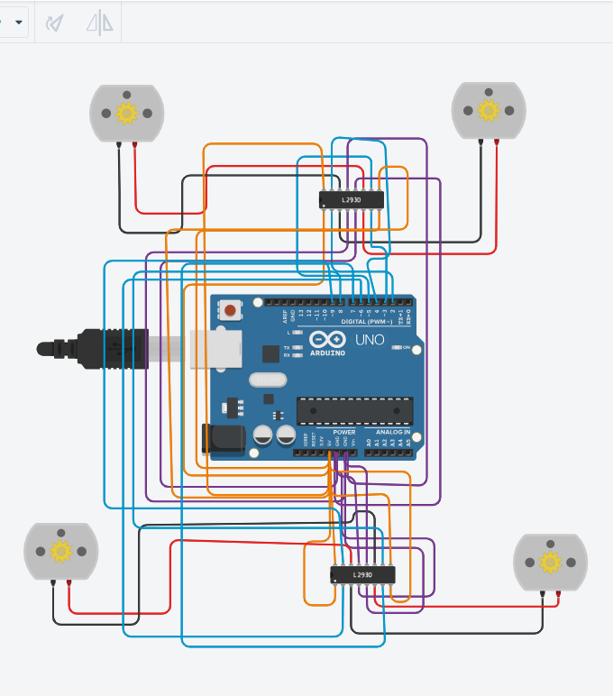

# ⚙️ 4× DC Motor Control via L293D | Motion Sequence Task

> **Smart Methods (الأساليب الذكية) — Summer Training Program**
> A simulation task built and tested on **Tinkercad Circuits**.


---

## 📋 Overview

This project drives **four DC motors** using **two L293D motor driver chips**, controlled by an Arduino Uno. The motors execute a timed sequence of movements:

| Step | Action | Duration |
|------|--------|----------|
| 1️⃣ | All 4 motors spin **forward** (same direction) | 30 seconds |
| 2️⃣ | All 4 motors **reverse direction** (backward) | 60 seconds |
| 3️⃣ | Motors **alternate right/left** to simulate turning motion | 60 seconds |
| 🛑 | Motors **stop permanently** | — |

---

## 🎥 Demo Video

<video src="PASTE-YOUR-VIDEO-LINK-HERE" controls width="600">
  Your browser does not support the video tag. Click below to watch the simulation.
</video>

> 🔗 **[Watch the full simulation video](PASTE-YOUR-VIDEO-LINK-HERE)**

---

## 🖼️ Circuit Diagram



*Arduino Uno R3 connected to two L293D motor driver chips, each controlling two DC motors.*

---

## ⚙️ How It Works

- **Driver Chip #1** controls **Motor 1** and **Motor 2**
- **Driver Chip #2** controls **Motor 3** and **Motor 4**
- Each motor is driven through a pair of Input pins on its L293D chip — setting one pin `HIGH` and the other `LOW` spins the motor in one direction; swapping the values reverses it.
- The Arduino sequences these pin states over time using `delay()` to produce the forward → backward → alternating-turn motion pattern.

---

## 🔌 Wiring / Pin Configuration

### Driver Chip #1 — Motor 1 & Motor 2

| L293D Pin | Function | Connects To |
|:---------:|----------|-------------|
| 1  | Enable 1,2 | 5V |
| 2  | Input 1 | Arduino Pin 2 |
| 3  | Output 1 | Motor 1 terminal |
| 4, 5 | GND | GND |
| 6  | Output 2 | Motor 1 terminal |
| 7  | Input 2 | Arduino Pin 3 |
| 8  | Vcc2 (motor power) | 5V |
| 9  | Input 3 | Arduino Pin 4 |
| 10 | Input 4 | Arduino Pin 5 |
| 11 | Output 3 | Motor 2 terminal |
| 12, 13 | GND | GND |
| 14 | Output 4 | Motor 2 terminal |
| 15 | Enable 3,4 | 5V |
| 16 | Vcc1 (logic power) | 5V |

### Driver Chip #2 — Motor 3 & Motor 4

Same pin layout as Chip #1, with Arduino control pins shifted:

| L293D Pin | Function | Connects To |
|:---------:|----------|-------------|
| 2  | Input 1 | Arduino Pin 6 |
| 7  | Input 2 | Arduino Pin 7 |
| 9  | Input 3 | Arduino Pin 8 |
| 10 | Input 4 | Arduino Pin 9 |
| *(all other pins follow the same power/GND/output pattern as Chip #1)* |

---

## 💻 Arduino Code

```cpp
// Control pins for Driver Chip #1 (Motor 1 & Motor 2)
int in1 = 2;
int in2 = 3;
int in3 = 4;
int in4 = 5;

// Control pins for Driver Chip #2 (Motor 3 & Motor 4)
int in5 = 6;
int in6 = 7;
int in7 = 8;
int in8 = 9;

void setup() {
  pinMode(in1, OUTPUT);
  pinMode(in2, OUTPUT);
  pinMode(in3, OUTPUT);
  pinMode(in4, OUTPUT);
  pinMode(in5, OUTPUT);
  pinMode(in6, OUTPUT);
  pinMode(in7, OUTPUT);
  pinMode(in8, OUTPUT);
}

void forward() {
  digitalWrite(in1, HIGH); digitalWrite(in2, LOW);
  digitalWrite(in3, HIGH); digitalWrite(in4, LOW);
  digitalWrite(in5, HIGH); digitalWrite(in6, LOW);
  digitalWrite(in7, HIGH); digitalWrite(in8, LOW);
}

void backward() {
  digitalWrite(in1, LOW); digitalWrite(in2, HIGH);
  digitalWrite(in3, LOW); digitalWrite(in4, HIGH);
  digitalWrite(in5, LOW); digitalWrite(in6, HIGH);
  digitalWrite(in7, LOW); digitalWrite(in8, HIGH);
}

void turnRight() {
  digitalWrite(in1, HIGH); digitalWrite(in2, LOW);
  digitalWrite(in3, LOW);  digitalWrite(in4, HIGH);
  digitalWrite(in5, HIGH); digitalWrite(in6, LOW);
  digitalWrite(in7, LOW);  digitalWrite(in8, HIGH);
}

void turnLeft() {
  digitalWrite(in1, LOW);  digitalWrite(in2, HIGH);
  digitalWrite(in3, HIGH); digitalWrite(in4, LOW);
  digitalWrite(in5, LOW);  digitalWrite(in6, HIGH);
  digitalWrite(in7, HIGH); digitalWrite(in8, LOW);
}

void stopMotors() {
  digitalWrite(in1, LOW); digitalWrite(in2, LOW);
  digitalWrite(in3, LOW); digitalWrite(in4, LOW);
  digitalWrite(in5, LOW); digitalWrite(in6, LOW);
  digitalWrite(in7, LOW); digitalWrite(in8, LOW);
}

void loop() {
  // 1. Forward for 30 seconds
  forward();
  delay(30000);

  // 2. Backward for a full minute (60 seconds)
  backward();
  delay(60000);

  // 3. Alternate right/left for one minute
  unsigned long turnStart = millis();
  while (millis() - turnStart < 60000) {
    turnRight();
    delay(1000);
    turnLeft();
    delay(1000);
  }

  stopMotors();
  while (true) {
    // Final stop after completing all movements
  }
}
```

---

## 🧰 Tools & Technologies

- **Simulation Platform:** [Tinkercad Circuits](https://www.tinkercad.com/)
- **Microcontroller:** Arduino Uno R3
- **Motor Driver:** 2× L293D
- **Language:** C++ (Arduino framework)
- **Components:** 4× DC Motors

---

## 📂 Repository Structure

```
├── dc_motors_code.ino   # Arduino source code
├── circuit.png            # Circuit diagram screenshot
├── demo_video.mp4          # Simulation demo video
└── README.md                # Project documentation
```

---

## ✅ Task Requirements Checklist

- [x] 4 DC motors connected via 2× L293D motor drivers
- [x] All motors move forward for 30 seconds
- [x] All motors reverse direction for 60 seconds
- [x] Motors alternate right/left turns for 60 seconds
- [x] Simulated and verified on Tinkercad
- [x] Code and demo uploaded to GitHub

---

## 👩‍💻 Author

**Budur Saad**
Summer Training Program — Smart Methods (الأساليب الذكية)

---

<p align="center">Made with 💙 during the Smart Methods Summer Training Program</p>
